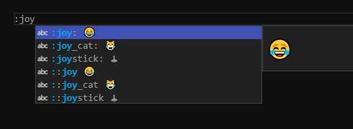

<!--
 * @Author: CollapseNav
 * @Date: 2020-06-25 17:26:25
 * @LastEditors: CollapseNav
 * @LastEditTime: 2020-06-25 20:51:55
 * @Description: 
-->

# 你值得拥有的Emoji 😂 🙏 👌

## 插件

理论上来说只要知道 `emoji` 的代码,直接复制到进来也能使用 `:joy:` --> :joy: 但是如果有什么可以更加方便导入的方式,这肯定是更好的了
下面介绍一个大概会比较好用插件,可以更加直观更加方便地导入 😏
插件 : `:emojisense:`

## 使用

使用 `:` 触发提示

So easy !!!

## 最后

希望 🙏 没事

