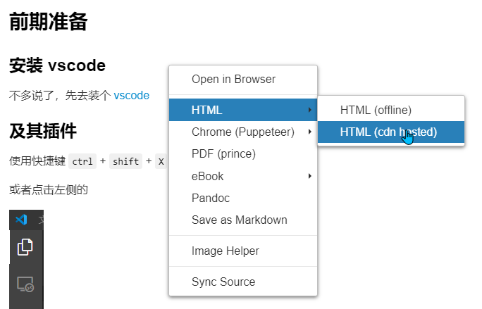
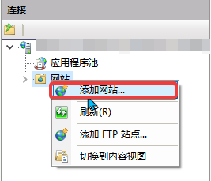
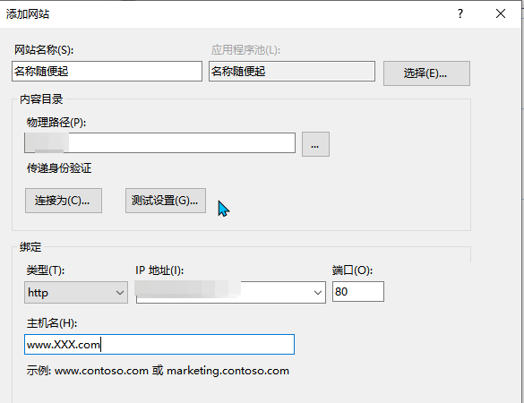

<!--
 * @Author: CollapseNav
 * @Date: 2020-06-21 00:24:14
 * @LastEditors: CollapseNav
 * @LastEditTime: 2020-06-25 20:51:42
 * @Description:
-->
# 导出为HTML

## 为什么要导出成HTML

因为 **Markdown的预览效果实际上就是HTML(大概可以这么理解)**
而且导出为 `HTML` 之后可以用 `nginx` `IIS` 之类的做个反向代理，把工作区打个包丢到服务器上去就行了
然后这个文档就是这么做的

## 导出

打开预览之后，可以直接在预览页上右键



直接导出为html
如果你的 markdown 文件叫做 `XX.md`
导出后会生成一个叫 `XX.html` 的文件
然后在其他页面中直接使用

```markdown
[跳转到XX.html](./XX.html)
```

的方式做个链接
等到那个页面也导出为 html 的时候
就可以通过点击那个链接进行跳转

## Nginx

### 安装nginx(linux)

我用的是Ubuntu，所以

```bash
sudo apt-get install nginx
```

如果是centos的话
自己去 [bing一下](https://cn.bing.com/search?q=centos+install+nginx)

### 配置

如果使用的是 [vscode remote](./remote.html) 连接服务器
那么可以直接打开 `/etc/nginx/nginx.conf` 文件进行编辑
在`nginx.conf`文件中的 `http{...}` 中添加

```text
server {
	listen 80;  # 监听的端口 ，一般用 80 就好了，其他的端口不一定开着
	server_name  xx.xx.xx.xx www.xxxx.com;  # 绑定的 ip 或者域名
	location / {
		root /XXX/markdowndoc; # 你的markdown文档的文件夹路径
	}
}
```

然后把你希望第一个展示的页面重命名为 `index.html`
使用命令重新加载一下配置

```bash
sudo nginx -s reload
```

然后使用你绑定的ip或者域名访问就行了
如果访问不了，查看你的防火墙设置(图省事可以直接用80端口)

## IIS

### 开启IIS(Windows)

对于大多数人来说，可能还是用Windows简单一些
如果不知道怎么开启 IIS ，那就去 [bing一下](https://cn.bing.com/search?q=IIS)

### 配置

打开 `IIS 管理器`，然后





网站启动之后使用你绑定的ip或者域名访问就行了
如果访问不了，查看你的防火墙设置(图省事可以直接用80端口)


[<--返回](./index.html)
