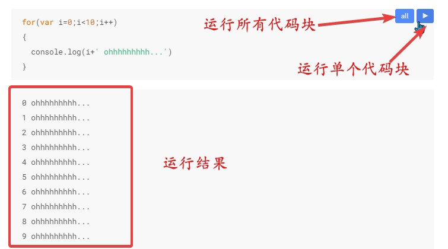

<!--
 * @Author: CollapseNav
 * @Date: 2020-06-21 00:24:14
 * @LastEditors: CollapseNav
 * @LastEditTime: 2020-06-26 13:42:32
 * @Description: 
--> 
# 拓展

## 引用视频

```text

```

其实引用的时候也可以嵌入视频，但是使用markdown的语法引入会使视频自动播放
生成的 `html` 中有 `autoplay` 标签
若要禁用 `autoplay` 则需要在生成的 `html` 中修改
或者直接写 `html` 引用，这样就不需要二次修改了

```html
<!-- autoplay标签直接不写 -->
<video controls>
  <!-- type需要对应上引用的资源 -->
  <source src="XXXX.mp4" type="video/mp4">
</video>

```

**郑重**推荐一下 傻颇(Porter Robinson) **WTM 吹爆！**

<div>
<video id="sc" controls width="100%">
  <!-- type需要对应上引用的资源 -->
  <source src="./src/psc720.mp4" type="video/mp4">
</video>

**Shelter 也超赞的！**

<video id="sh" controls width="100%">
  <!-- type需要对应上引用的资源 -->
  <source src="./src/ps720.mp4" type="video/mp4">
</video>
</div>

**傻颇No.1！！！**

嵌入的视频无法在预览的时候播放
但是转成 `html` 之后是可以正常播放的
个人不建议直接嵌入视频，不是所有版本的浏览器都能兼容这种方式
直接用 `<a>` 标签可能更好点

## 折叠

```html
<details>
  <summary><b>标题(描述)</b></summary>
  折叠起来的内容...

  折叠起来的内容...

  折叠起来的内容...

  折叠起来的内容...

  折叠起来的内容...

  折叠起来的内容...
  
</details>
```

<details>
  <summary><b>标题(描述)</b></summary>
折叠起来的内容...

折叠起来的内容...

折叠起来的内容...

折叠起来的内容...

折叠起来的内容...

折叠起来的内容...

</details>

### 注意事项

需要注意的一点是， todo 和代码块  被包在 **折叠** 中时会有点冲突，可能会出现格式错误，慎用！！！
如果觉得拓展部分写起来很难受的话……可以自己在vscode中写 **[snippets](https://cn.bing.com/search?q=vocode+snippet)**

## 文件预览(不直接下载)

> 实际上还有些其他的问题，但是应该可以满足日常的简单需求

```html
最好使用相对路径
<a href="./XXXX.mp3">获取文件(先尝试在浏览器中打开)</a>
```

<a href="./src/Miruku 100bpm.mp3">获取文件(预览)</a>

## 文件下载(直接下载)

> 还挺好用的

```html
最好使用相对路径
<a href="./XXXX.mp3" download="YYYY.mp3">获取文件(直接开始下载)</a>
```

<a href="./src/Miruku 100bpm.mp3" download="Miruku 100bpm.mp3">获取文件(直接下载)</a>

### 建议

建议直接使用相对路径，把文件都放在 `.md` 文件所在的目录下，这样移动起来比较方便
而且可以直接使用 vscode 提供的文件路径补全功能(不知道应该怎么说，我的理解就是这个)

### 两个视频文件

<a href="./src/Porter_Robinson_Something_Comforting.mp4" download="Porter Robinson-Something Comforting.mp4">Porter Robinson-Something Comforting</a>

<a href="./src/Porter_Robinson_Madeon_Shelter.mp4" download="Porter Robinson Madeon Shelter.mp4">Porter Robinson-Shelter</a>


## 可运行的代码块

(这一段可能需要你把文档拉下来看才行)

```javascript {cmd="node"}
for(var i=0;i<10;i++)
{
  console.log(i+' ohhhhhhhhh...')
}
```

如果要用,得把设置里面的 `Enable Script Execution` 打开
使用代码块的时候可以通过指定 cmd 的方式运行代码块中的代码



这东西用法比较复杂,我也还没搞明白
不是很推荐用
