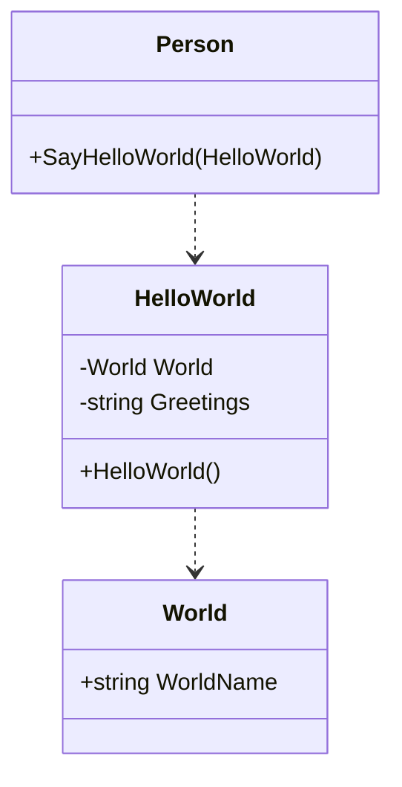
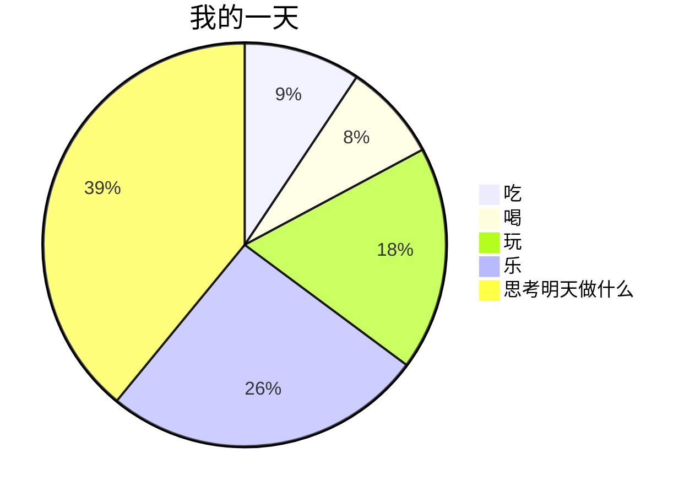
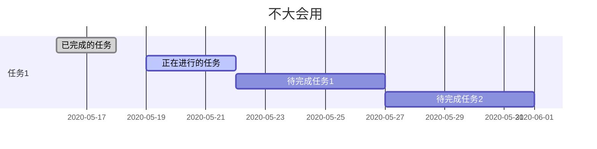

<!--
 * @Author: CollapseNav
 * @Date: 2020-06-11 22:20:21
 * @LastEditors: CollapseNav
 * @LastEditTime: 2020-08-11 09:04:26
 * @Description:
-->

# 画图

## 前言(防怼)

我知道存在其他更好用的，更全面的画图工具
但我就是不想装那些软件(不管是不是需要破解)
我日常做开发的时候就用用 vscode (从 vs 转到了 vscode)
> 只用一个编辑器(虽然是当IDE用的)就能实现我的大部分(甚至是所有)需求

这对我来说非常有吸引力

## 流程图

[流程图文档](https://flowchart.js.org/)

```text
    ```flow
    先定义流程图的元素
    st=>start: 开始:>http://cn.bing.com
    op=>operation: 操作
    cond=>condition: 判断
    e=>end: 结束

    然后描述流程图的步骤
    st->op->cond->end
    cond(yes)->e
    cond(no)->op
    ```
```

```flow
st=>start: 开始:>http://cn.bing.com
op=>operation: 操作
cond=>condition: 判断
e=>end: 结束

st->op->cond->end
cond(yes)->e
cond(no)->op
```

## 类图

[类图文档](https://mermaid-js.github.io/mermaid/#/classDiagram)

```text
    ```mermaid
    classDiagram
    class Person{
        +SayHelloWorld(HelloWorld)
    }
    class HelloWorld{
        -World World
        -string Greetings
        +HelloWorld()
    }
    class World{
        +string WorldName
    }

    Person ..> HelloWorld
    HelloWorld ..> World
    ```
```




## 饼图

[饼图文档](https://mermaid-js.github.io/mermaid/#/pie)

```text
    ```mermaid
    pie
    title 我的一天
    "吃" :12
    "喝" : 10
    "玩" : 23
    "乐" :  33
    "思考明天做什么" : 50
    ```
```



## 时序图

[时序图文档](https://mermaid-js.github.io/mermaid/#/sequenceDiagram)

```text
    ```sequence {theme=hand}
    Title: Here is a title
    A->B: Normal line
    B-->C: Dashed line
    C->>D: Open arrow
    D-->>A: Dashed open arrow
    ```
```

```sequence {theme=hand}
Title: Here is a title
A->B: Normal line
B-->C: Dashed line
C->>D: Open arrow
D-->>A: Dashed open arrow
```

## 甘特图

[甘特图文档](https://mermaid-js.github.io/mermaid/#/gantt)

```text
    ```mermaid
    gantt
    dateFormat  YYYY-MM-DD
    title 不大会用
    section 任务1
    已完成的任务           :done,    des1, 2020-05-16,2020-05-18
    正在进行的任务               :active,  des2, 2020-05-19, 3d
    待完成任务1               :         des3, after des2, 5d
    待完成任务2              :         des4, after des3, 5d
    ```
```



[<--返回](./index.html)
