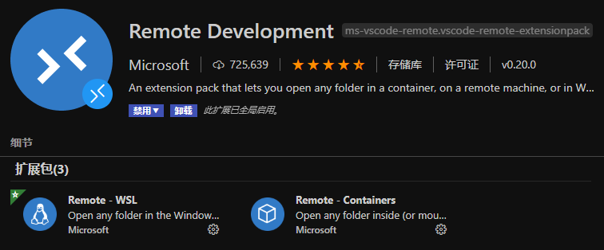

<!--
 * @Author: CollapseNav
 * @Date: 2020-06-13 13:50:23
 * @LastEditors: CollapseNav
 * @LastEditTime: 2020-06-25 20:49:57
 * @Description: 
--> 
# 远程写文档

## 前言: 为什么要远程(Remote)？

**主要**还是因为，本地写好了之后还得再上传到远程服务器，照我的想法呢，干脆就直接在服务器上把文档写好就行了

## 前期准备

### vscode

二话不说先去弄个 [vscode](https://code.visualstudio.com/)

### 插件

使用快捷键 `ctrl` + `shift` + `X` 打开插件页，然后搜索
或者点击左侧的

 

图标打开插件页，然后搜索 **Remote Development** ，直接安装



然后把 **Markdown** 需要用的插件都在服务器上装一遍

1. **Markdown All in One**
2. **Markdown Preview Enhanced** (一些特殊效果的实现就靠这个插件)
3. **markdownlint** (主要是用来语法提示之类的)
4. **Markdown Preview Mermaid Support** (拓展画图功能)
5. **Markdown TOC** (生成标题列表，点击了能够跳转的那种)
6. **Markdown Extended** (虽然不记得有啥用了，但是装就好了)

### 之前踩过的坑

不知道是不是所有发行版都不带 **pandoc** ，反正我的那个没有，所以如果出现不能预览的情况，需要

```bash
sudo apt-get install pandoc
```

## Done

反正这些插件装完之后就可以直接开始写了，和在自己电脑上写应该没什么区别
顶多就是延迟会高点
