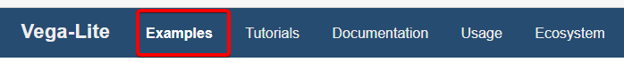
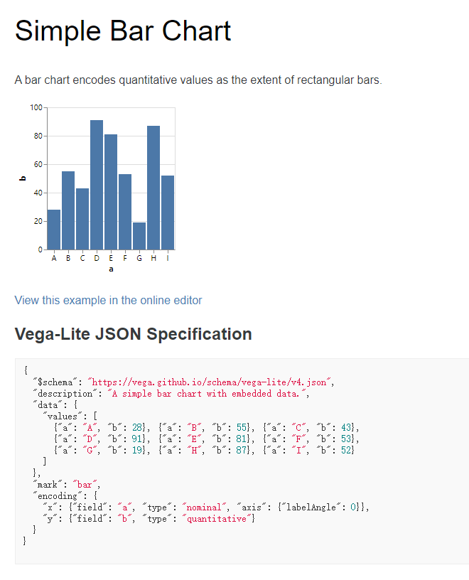

# 使用Vega画图

前段时间发现插件更新了 **Vega** 的画图方式,然后稍微研究了一下,发现还算是挺好用的,所以在此做个记录

## 介绍

插件 **Markdown Preview Enhanced** 支持[Vega](https://vega.github.io/vega/)和[Vega-lite](https://vega.github.io/vega-lite/)
前者的设置使用相对后者来说更加复杂

但是如果不想深入研究的话,两者使用起来并没有什么区别

下面以最简单,最常见的柱形图(Bar)为例,演示如何使用**Vega-lite**画图

## 直球

首先打开 [Vega-lite](https://vega.github.io/vega-lite/)



打开 Examples 列表


里面有很多模板,在这儿我使用最基础的**Bar Chart**



直接复制网站上提供的`json`(我自己加了个`width`),贴到` ```vega-lite ` 块中(如下code)

```text
    ```vega-lite
    {
    "$schema": "https://vega.github.io/schema/vega-lite/v4.json",
    "description": "A simple bar chart with embedded data.",
    "width": 500,
    "data": {
        "values": [
        {"a": "A", "b": 28}, {"a": "B", "b": 55}, {"a": "C", "b": 43},
        {"a": "D", "b": 91}, {"a": "E", "b": 81}, {"a": "F", "b": 53},
        {"a": "G", "b": 19}, {"a": "H", "b": 87}, {"a": "I", "b": 52}
        ]
    },
    "mark": "bar",
    "encoding": {
        "x": {"field": "a", "type": "nominal", "axis": {"labelAngle": 0}},
        "y": {"field": "b", "type": "quantitative"}
    }
    }
    ```
```

即可生成基础 **Bar Chart**

```vega-lite
{
"$schema": "https://vega.github.io/schema/vega-lite/v4.json",
"description": "A simple bar chart with embedded data.",
"width": 500,
"data": {
    "values": [
    {"a": "A", "b": 28}, {"a": "B", "b": 55}, {"a": "C", "b": 43},
    {"a": "D", "b": 91}, {"a": "E", "b": 81}, {"a": "F", "b": 53},
    {"a": "G", "b": 19}, {"a": "H", "b": 87}, {"a": "I", "b": 52}
    ]
},
"mark": "bar",
"encoding": {
    "x": {"field": "a", "type": "nominal", "axis": {"labelAngle": 0}},
    "y": {"field": "b", "type": "quantitative"}
}
}
```

其他的图像也是也是类似的操作
复制完成之后按照`values`提供的格式**改改数据**就好了

## 很直的曲线球

可以试着将 **数据** 分离开来
比如使用一个新的文件存放数据

`./src/bar_data.json`

```json
[
    {"a": "A", "b": 28}, {"a": "B", "b": 55}, {"a": "C", "b": 43},
    {"a": "D", "b": 91}, {"a": "E", "b": 81}, {"a": "F", "b": 53},
    {"a": "G", "b": 19}, {"a": "H", "b": 87}, {"a": "I", "b": 52}
]
```

然后将上面的 `values` 改为 `url`

```text
    ```vega-lite
    {
    "$schema": "https://vega.github.io/schema/vega-lite/v4.json",
    "description": "A simple bar chart with embedded data.",
    "width": 500,
    "data": {
        "url": "./src/bar_data.json"
    },
    "mark": "bar",
    "encoding": {
        "x": {"field": "a", "type": "nominal", "axis": {"labelAngle": 0}},
        "y": {"field": "b", "type": "quantitative"}
    }
    }
    ```
```

也能达到相同的效果

```vega-lite
{
"$schema": "https://vega.github.io/schema/vega-lite/v4.json",
"description": "A simple bar chart with embedded data.",
"width": 500,
"data": {
    "url": "./src/bar_data.json"
},
"mark": "bar",
"encoding": {
    "x": {"field": "a", "type": "nominal", "axis": {"labelAngle": 0}},
    "y": {"field": "b", "type": "quantitative"}
}
}
```

当然也可以直接使用`http`直接从后端那边拿数据(只要返回的数据格式能对上)


## 蛇皮球

上述的两种做法只能做出静态图像,**vega**支持的添加事件(如hover事件之类的)就完全无法使用
而且如果导出为`html`,图像无法随着数据的变化而变化
所以若是想使用更强的功能,还是得上 `html+js`

首先在`md`文件的开头加上

```html
<!-- 不会显示出来 -->
<script src="https://cdn.jsdelivr.net/npm/vega@5.17.0"></script>
<script src="https://cdn.jsdelivr.net/npm/vega-lite@4.17.0"></script>
<script src="https://cdn.jsdelivr.net/npm/vega-embed@6.12.2"></script>
```

在这之后加上

```html
<div id="vis"></div>
<script type="text/javascript">
    var config = {
        "$schema": "https://vega.github.io/schema/vega-lite/v4.json",
        "description": "A simple bar chart with embedded data.",
        "width": 500,
        "data": {
            "url": "./src/bar_data.json"
        },
        "mark": "bar",
        "encoding": {
            "x": {"field": "a", "type": "nominal", "axis": {"labelAngle": 0}},
            "y": {"field": "b", "type": "quantitative"}
        }
    }
    vegaEmbed('#vis', config);
</script>
```

如果有兴趣,可以将这个 `config` 做成一个 **url**
然后当`config`改变,图像也会有相应的改变

<script src="https://cdn.jsdelivr.net/npm/vega@5.17.0"></script>
<script src="https://cdn.jsdelivr.net/npm/vega-lite@4.17.0"></script>
<script src="https://cdn.jsdelivr.net/npm/vega-embed@6.12.2"></script>

<div id="vis"></div>
<script type="text/javascript">
    var config = {
        "$schema": "https://vega.github.io/schema/vega-lite/v4.json",
        "description": "A simple bar chart with embedded data.",
        "width": 500,
        "data": {
            "url": "./src/bar_data.json"
        },
        "mark": "bar",
        "encoding": {
            "x": {"field": "a", "type": "nominal", "axis": {"labelAngle": 0}},
            "y": {"field": "b", "type": "quantitative"}
        }
    }
    vegaEmbed('#vis', config);
</script>

至于这种写法到底算是方便还是不方便,我就不知道了


[<--返回](./index.html)
